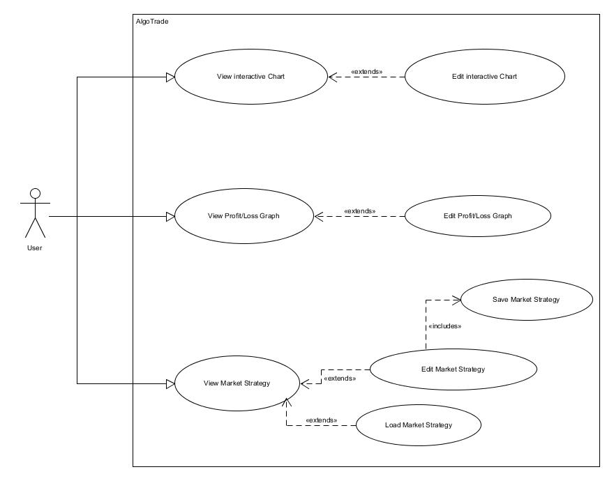
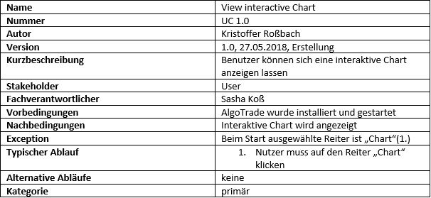
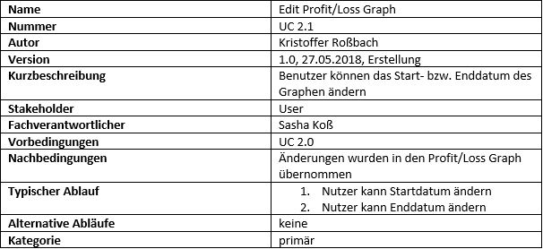
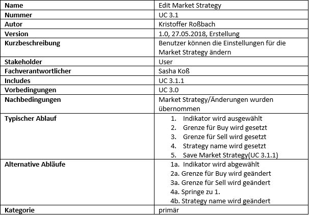
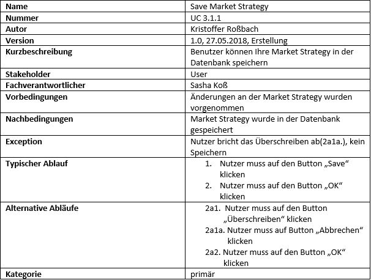
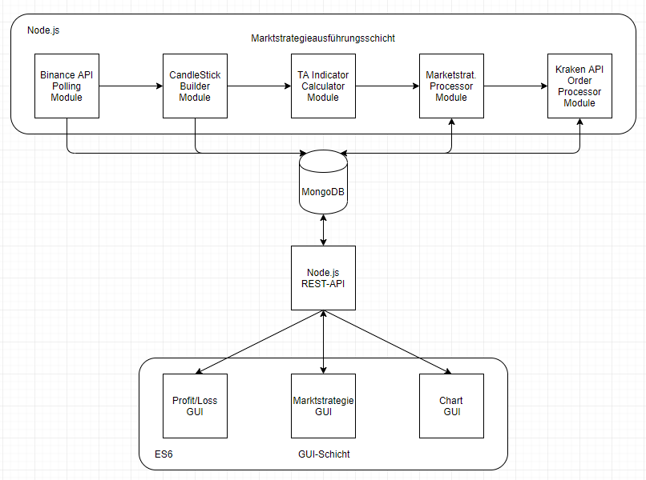
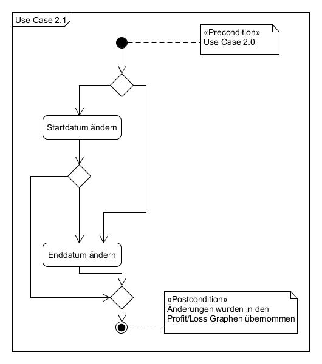
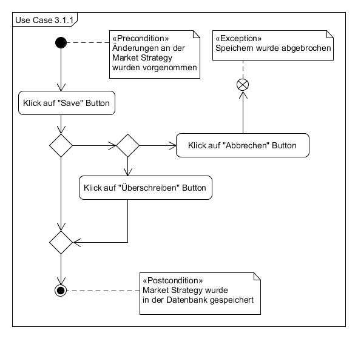
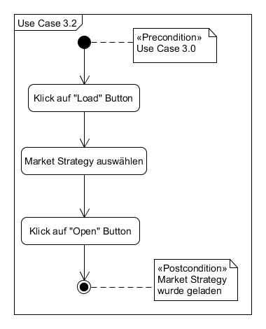
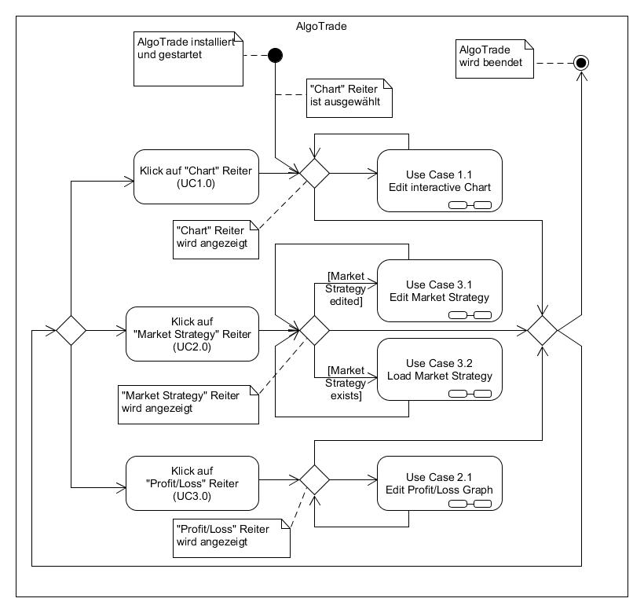

# Anforderungs- und Entwurfsspezifikation ("Pflichtenheft")
Cryptocurrency Algotrader

Autoren: Sasha Koß, Kristoffer Roßbach

<!-- MarkdownTOC autolink=true -->

- [1 Einführung](#1-einf%C3%BChrung)
  - [1.1 Beschreibung](#11-beschreibung)
    - [Projektname: Cryptocurrency Algotrade](#projektname-cryptocurrency-algotrade)
    - [Projektbeschreibung](#projektbeschreibung)
  - [1.2 Ziele](#12-ziele)
    - [Anwendungsbereich](#anwendungsbereich)
    - [Motivation](#motivation)
    - [Umfang](#umfang)
    - [Marktanforderungen](#marktanforderungen)
    - [Zielgruppe](#zielgruppe)
    - [Abgrenzung](#abgrenzung)
- [2 Anforderungen](#2-anforderungen)
  - [2.1 Funktionale Anforderungen](#21-funktionale-anforderungen)
    - [2.1.1 Use Case 1.0 - Show interactive Chart](#211-use-case-10---show-interactive-chart)
    - [2.1.2 Use Case 1.1 - Edit Settings interactive Chart](#212-use-case-11---edit-settings-interactive-chart)
    - [2.1.3 Use Case 2.0 - Show Profit/Loss Graph](#213-use-case-20---show-profitloss-graph)
    - [2.1.4 Use Case 2.1 - Edit Settings Profit/Loss Graph](#214-use-case-21---edit-settings-profitloss-graph)
    - [2.1.5 Use Case 3.0 - Show Market Strategy](#215-use-case-30---show-market-strategy)
    - [2.1.6 Use Case 3.1 - Edit Settings Market Strategy](#216-use-case-31---edit-settings-market-strategy)
    - [2.1.7 Use Case 3.1.1 - Save Market Strategy](#217-use-case-311---save-market-strategy)
    - [2.1.8 Use Case 3.2 - Load Market Strategy](#218-use-case-32---load-market-strategy)
  - [2.2 Nicht-funktionale Anforderungen](#22-nicht-funktionale-anforderungen)
    - [2.2.1 Rahmenbedingungen](#221-rahmenbedingungen)
    - [2.2.2 Betriebsbedingungen](#222-betriebsbedingungen)
    - [2.2.3 Qualitätsmerkmale](#223-qualit%C3%A4tsmerkmale)
  - [2.3 Graphische Benutzerschnittstelle](#23-graphische-benutzerschnittstelle)
    - [GUI-Mockups](#gui-mockups)
  - [2.4 Anforderungen im Detail](#24-anforderungen-im-detail)
    - [User](#user)
- [3 Technische Beschreibung](#3-technische-beschreibung)
  - [3.1 Systemübersicht](#31-system%C3%BCbersicht)
    - [Systemarchitekturdiagramm](#systemarchitekturdiagramm)
    - [Schnittstellenbeschreibung](#schnittstellenbeschreibung)
  - [3.2 Softwarearchitektur](#32-softwarearchitektur)
  - [3.3 Datenmodell](#33-datenmodell)
    - [ER-Diagramm](#er-diagramm)
  - [3.4 Abläufe](#34-abl%C3%A4ufe)
    - [3.4.1 Aktivitätsdiagramm UC 1.0](#341-aktivit%C3%A4tsdiagramm-uc-10)
    - [3.4.2 Aktivitätsdiagramm UC 1.1](#342-aktivit%C3%A4tsdiagramm-uc-11)
    - [3.4.3 Aktivitätsdiagramm UC 2.0](#343-aktivit%C3%A4tsdiagramm-uc-20)
    - [3.4.4 Aktivitätsdiagramm UC 2.1](#344-aktivit%C3%A4tsdiagramm-uc-21)
    - [3.4.5 Aktivitätsdiagramm UC 3.0](#345-aktivit%C3%A4tsdiagramm-uc-30)
    - [3.4.6 Aktivitätsdiagramm UC 3.1](#346-aktivit%C3%A4tsdiagramm-uc-31)
    - [3.4.7 Aktivitätsdiagramm UC 3.1.1](#347-aktivit%C3%A4tsdiagramm-uc-311)
    - [3.4.8 Aktivitätsdiagramm UC 3.2](#348-aktivit%C3%A4tsdiagramm-uc-32)
    - [3.4.9 Aktivitätsdiagramm für alle Use Cases](#349-aktivit%C3%A4tsdiagramm-f%C3%BCr-alle-use-cases)
- [4 Projektorganisation](#4-projektorganisation)
  - [4.1 Annahmen](#41-annahmen)
    - [Technologien](#technologien)
    - [Einschränkungen](#einschr%C3%A4nkungen)
    - [Interne Qualitätsanforderungen](#interne-qualit%C3%A4tsanforderungen)
  - [4.2 Verantwortlichkeiten](#42-verantwortlichkeiten)
  - [4.3 Grober Projektplan](#43-grober-projektplan)
- [5 Anhänge](#5-anh%C3%A4nge)
  - [5.1 Glossar](#51-glossar)
    - [Definitionen](#definitionen)
    - [Abkürzungen](#abk%C3%BCrzungen)
    - [Begriffe](#begriffe)
  - [5.2 Referenzen](#52-referenzen)
    - [Indikatoren](#indikatoren)
    - [Candlestick Chart](#candlestick-chart)
    - [Exchange Position / Orders \(hold/buy/sell\)](#exchange-position--orders-holdbuysell)

<!-- /MarkdownTOC -->

# 1 Einführung

## 1.1 Beschreibung
### Projektname: Cryptocurrency Algotrade
### Projektbeschreibung
Die Algotrade Software holt sich die aktuelle Handelshistorie einer Crypto-Börse und erstellt anhand dieser Daten eine Candlestick-Chart.
Zeitgleich werden mit den berechneten Candlesticks verschiedene technische Indikatoren ermittelt.

Die Indikatoren werden zur Umsetzung der vom Benutzer konfigurierten Marktstrategie verwendet. Der Benutzer kann die Grenzen für jeden Indikator individuell einstellen und eine Marktentscheidung(Buy/Hold/Sell) damit verknüpfen. Die Positionsgröße wird anhand der Depoteinlage ermittelt, der Benutzer kann dazu einen prozentualen Bereich konfigurieren.

Der Benutzer muss ein Konto mit Einlage auf der jeweiligen Börse besitzen, weil die Algotrade Software die Entscheidungen per API-Request durchführt.

Es kann zusätzlich eine Gewinn/Verlust-Übersicht über einen bestimmten Zeitraum eingesehen werden.

## 1.2 Ziele
### Anwendungsbereich
Der Algotrader wird zuerst im privaten Bereich zum Testen von Marktstrategien eingesetzt werden.

### Motivation
Die Blockchain bzw. der Cryptocurrency-Markt befindet sich seit 2015 in einer starken und volatilen Wachstumsphase, deswegen kann ein Einstieg in diesen Markt für risikofreudige Unternehmer lukrativ sein.

### Umfang
Die Software wird im ersten Entwicklungsschritt nur mit der Binance API funktionieren, weil diese kostenlos verwendbar ist und eine vergleichbar gute Performance liefert.

Indikatoren für Tradeentscheidungen und Charts:
+ MFI
+ RSI
+ CCI
+ EMA
+ Ichimoku Cloud

Marktstrategien:
+ Buy/Hold/Sell Entscheidung nach den Indikatoren
+ Speichern/Laden von Strategien
+ Indikatoren aktivieren/deaktivieren

Gewinn/Verlust Übersicht:
+ Zeitraum wählbar
+ Währungspaar wählbar
+ Strategie wählbar

Push-Benachrichtigung:
+ Bei ausgeführter Order mit Orderdetails

### Marktanforderungen
Der Cryptocurrency-Algobot-Markt ist noch Jung, dementsprechend einfach und teuer sind die aktuellen Produkte am Markt.

Übersicht: https://themerkle.com/top-6-bitcoin-trading-bots/

### Zielgruppe
Die Software ist für Anwender konzipiert, die ein Grundverständnis von Markttechnik besitzen und eine individuelle Marktstrategie an einer Crypto-Börse umsetzen wollen.

### Abgrenzung
+ beinhaltet keine vorgefertigten Marktstrategien
+ kein BackTesting der Strategien
+ keine direkten Trades über die GUI

# 2 Anforderungen

## 2.1 Funktionale Anforderungen
Use-Case Diagramm für AlgoTrade:
| **Name** | View interactive Chart |
| **Nummer** | UC 1.0 |
| **Autor** | Kristoffer Roßbach |
| **Version** | 1.0, 27.05.2018, Erstellung |
| **Kurzbeschreibung** | bla |
| **Stakeholder** | bla |
| **Fachverantwortlicher** | Sasha Koß |
| **Vorbedingungen** | bla |
| **Nachbedingungen** | bla |
| **Exception** | bla |
| **Typischer Ablauf** | 1. bla
2. bla
3. bla |
| **Alternative Abläufe** | 1a. bla
3a. bla |
| **Kategorie** | primär |

### 2.1.1 Use Case 1.0 - Show interactive Chart
Anzeigen des interaktiven Charts:

### 2.1.2 Use Case 1.1 - Edit Settings interactive Chart
Bearbeiten der Einstellungen fürs interaktive Chart.

### 2.1.3 Use Case 2.0 - Show Profit/Loss Graph
Anzeigen des Profit/Loss Graphen:

### 2.1.4 Use Case 2.1 - Edit Settings Profit/Loss Graph
Bearbeiten der Einstellungen des Profit/Loss Graphen:

### 2.1.5 Use Case 3.0 - Show Market Strategy
Anzeigen der Market Strategy:

### 2.1.6 Use Case 3.1 - Edit Settings Market Strategy
Bearbeiten der Market Strategy:

### 2.1.7 Use Case 3.1.1 - Save Market Strategy
Speichern der Market Strategy:

### 2.1.8 Use Case 3.2 - Load Market Strategy
Laden der Market Strategy:

## 2.2 Nicht-funktionale Anforderungen

### 2.2.1 Rahmenbedingungen
Die Börsen geben die Datenstruktur für die Tradehistorie und die Orderdetails über die REST-API per JSON vor.

Die Indikatoren und Markttechniken werden in 5.2 referenziert.

### 2.2.2 Betriebsbedingungen
Web Browser: Chrome
OS: Windows 8.1/10 64Bit
Programmiersprachen: Node.js, Javascript ES6

### 2.2.3 Qualitätsmerkmale
+ Performance: Die Software muss in der Lage sein Tradingentscheidungen in kürzester Zeit, nach Eingang der Tradedaten, zu fällen.

+ Sicherheit: Die Benutzerdaten müssen besonders Geschützt werden, weil sehr sensible Daten benötigt werden, wie zum Beispiel der private API-Key zum Handeln an der Börse.

+ Zuverlässigkeit: Mit der Software wird an einem Terminmarkt gehandelt, deswegen ist die Zuverlässigkeit von höchster Priorität. Bei einem Absturz des Programms muss gewährleisten sein, dass diese automatisch und in kürzester Zeit neu startet.

+ Benutzerfreundlichkeit: Die Benutzeroberfläche mit dem interaktiven Candlestick-Chart muss den üblichen GUI-Standards genügen.

## 2.3 Graphische Benutzerschnittstelle
### GUI-Mockups
Interaktives Candlestick Chart

Marktstrategie Einstellungen

Gewinn/Verlust Übersicht

Marktstrategie laden

## 2.4 Anforderungen im Detail

### User

| **Als** | **möchte ich** | **so dass** | **Akzeptanz** |
| :------ | :----- | :------ | :-------- |
| User | die Möglichkeit haben die interaktive Candlestick-Chart zu betrachten | ich eine Übersicht über die Kursänderungen habe | Betrachtung möglich |
| User | die Möglichkeit haben die Einstellungen für die interaktive Candlestick-Chart individuell anzupassen | ich die Kursänderungen über einen bestimmten Zeitraum für eine bestimmte Cryptocurrency betrachten kann | Einstellungen anpassbar |
| User | die Möglichkeit haben eine individuelle Market Strategy anzulegen | ich die Buys und Sells automatisieren kann | Market Strategy kann angelegt werden |
| User | die Möglichkeit haben verschiedene Market Strategies zu speichern/laden | ich deren Wirksamkeit testen kann ohne die Einstellungen zu verlieren | Speichern/Laden der Market Strategy möglich |
| User | die Möglichkeit haben Market Strategies anpassen zu können | ich deren Wirksamkeit verbessern kann | Market Strategy anpassbar |
| User | die Möglichkeit haben meinen Profit und Loss anzeigen zu lassen | ich Informationen über die Wirksamkeit meiner Market Strategy erhalte | Profit/Loss Graphen anzeigen möglich |
| User | die Möglichkeit haben meinen Profit und Loss über einen bestimmten Zeitraum betrachten zukönnen | ich die Wirksamkeit von meiner angepassten Market Strategy sehen kann | Zeitraum des Profit/Loss Graphen anpassbar |

# 3 Technische Beschreibung

## 3.1 Systemübersicht
### Systemarchitekturdiagramm

### Schnittstellenbeschreibung
Der Node.js Server holt sich in 10ms Intervalen die aktuelle Tradehistorie von der Binance REST-API im JSON-Format. Anschließend werde diese Daten verarbeitet und in die lokale MongoDB gespeichert.

Die verarbeiteten Daten werden dann der AlgoTrader GUI per Rest-API vom Node.js Server bereit gestellt.

Die Kraken REST-API wird bei einem Tradesignal vom Node.js Server zur Ausführung der entsprechenden Order angewiesen.

## 3.2 Softwarearchitektur

1. Polling Module: Holt die Tradehistorie von der Binance API, speichert diese in der Datenbank und hält diese im Arbeitsspeicher für das Candlestick Module.

2. Candlestick Module: Erstellt aus der Tradehistorie die Candlesticke die zur Berechnung der Indikatoren benötigt werden. Binance bietet Candlesticks über die API an, allerdings ist diese für unsere Anforderungen zu langsam.

3. TA Module: Berechnet die Indikatoren mithilfe der TA-Lib für das Marktstrategie Module

4. Marktstrategie Module: Läd beim Programmstart die Einstellungen für die Marktstrategie aus der Datenbank und triggert bei entsprechenden Indikatorwerten das Order Module.

6. Order Module: Passt zum Start des Programms und nach jeder Order die Ordergröße an. Die Einstellung dazu werden aus der Datenbank geladen.
Sendet die Order an die Kraken-API und speichert die Rückmeldung in der Datenbank.

7. Datenbank: Die MongoDB verwaltet und speichert die Programmspezifischen Daten für das Backend und Frontend.

8. Node.js REST: Die REST-API ist für die Datenbereitstellung des Frontends zuständig. Die Daten werden als JSON bereitgestellt.

9. Frontend: Das Frontend ermöglicht dem Benutzer die Marktstrategie einzustellen, die ausgeführten Trades in einem Profit/Loss Graph einzusehen und den Marktverlauf in einem Candlestick-Chart zu überwachen.

## 3.3 Datenmodell

### ER-Diagramm

Es bestehen keine relationalen Verbindungen zwischen den Entitys, weil in diesem Projekt MongoDB zum Einsatz kommt, eine dokumentenbasiert Datenbank.

1. binance_trades:
Die Entity binance_trades speichert die Tradehistorie der BinanceAPI, damit bei einem neustart des AlgoTraders genug Zeitreihen vorhanden sind zum berechnen der Indikatoren.

2. market_strategie:
Speichert die Marktstrategieeinstellungen des Benutzers mit den Triggergrenzen und Ordergröße.

3. candlesticks:
Die candlesticks Tabelle speichert die Werte für das Frontend Candlestick-Chart.

4. kraken_orders:
Die Tabelle kraken_orders speichert die Orderdetails nach der Ausführung am Markt einer Order bei Kraken.

5. executed_trades:
executed_trades speichert die Indikatorenwerte und Marktdetails beim absenden der Order an Kraken.

6. user_settings:
Speichert die API-Keys des Benutzers für die Zugriffe auf Kraken und Binance.

## 3.4 Abläufe

### 3.4.1 Aktivitätsdiagramm UC 1.0

### 3.4.2 Aktivitätsdiagramm UC 1.1

### 3.4.3 Aktivitätsdiagramm UC 2.0

### 3.4.4 Aktivitätsdiagramm UC 2.1

### 3.4.5 Aktivitätsdiagramm UC 3.0

### 3.4.6 Aktivitätsdiagramm UC 3.1

### 3.4.7 Aktivitätsdiagramm UC 3.1.1

### 3.4.8 Aktivitätsdiagramm UC 3.2

### 3.4.9 Aktivitätsdiagramm für alle Use Cases

# 4 Projektorganisation

## 4.1 Annahmen
+ Die Crypto-Börsen Binance und Kraken bleiben zu 99% verfügbar
+ Cryptocurrencys bleiben über die Projektlaufzeit in Deutschland legal

### Technologien
+ Node.js mit NPM
+ MongoDB
+ Javascript ES6
+ Verwendete Libs: TA-LIB, Knex.js, dotenv, express, fs-extra, parse-duration, pino, request, request-promise

### Einschränkungen
+ Die Programmgeschwindigkeit wird zum Großteil durch die REST-APIs der Börsen bestimmt.
+ Die Internetverbindung des Servers muss sehr niedrige Pingzeiten zu den Börsen gewährleisten.
+ Das Betriebssystem muss für den 24/7 Betrieb geeignet sein.

### Interne Qualitätsanforderungen
+ Softwarequalität muss den Performance ansprüchen des Projektes entsprechen
+ Quellcodedokumentation auf Englisch
+ Funktionalität des Codes wird vor dem Push geprüft
+ Quellcode vor dem Push mit JS Beautifier formatieren

## 4.2 Verantwortlichkeiten
Sasha Koß:

    Rolle: Projektleitung, Backend
    Softwarebausteine: Marktstrategieausführungsschicht; Datenbank; Node.js; REST-API

Kristoffer Roßbach:

    Rolle: Frontend
    Softwarebausteine: Profit/Loss GUI; Marktstrategie GUI; Chart GUI

## 4.3 Grober Projektplan

31.05
+ Abgabe Projektplan / Pflichtenheft

07.06
+ Backend: Binance API für Marktdaten + Indikatoren Implementiert; Frontend: GUI ohne Funktion umgesetzt

14.06
+ Backend: Kraken API für Orders Implementiert; Frontend: Funktionale-Anforderungen umgesetzt

21.06
+ Backend: Profit/Loss Auswertung + Marktstrategien; Frontend: Charts eingebunden

28.06
+ Puffer

05.07
+ Letztes Praktika / Nachbesserung / Präsentationsvorbereitung

12.07
+ Abgabe Projekt / Präsentationsvorbereitung

# 5 Anhänge

## 5.1 Glossar

### Definitionen

+ Polling: Abfrage einer Resource nach Updates innerhalb eines bestimmten Intervals.

+ Handelshistorie: Vollständige Transaktionsliste eines Terminmarktes.

+ Indikatoren: Technische Indikatoren zur Analyse von Kursverläufen an Börsen

+ Marktstrategie: Strategie anhand von Indikatoren wann gekauft und verkauft wird.

+ Markttechnik: Technische Analyse eines Kursverlaufes mithilfe von Indikatoren.

+ Order: Eine Order ist ein Auftrag an einem Terminmarkt zum Kauf oder Verkauf eines Assets.

### Abkürzungen

+ MFI - Money Flow Index
+ RSI - Relative Strength Index
+ CCI - Commodity Channel Index

### Begriffe
+ Crypto: Kurzschreibweisen für Cryptocurrency, ein digitales und dezentrales Zahlungsmittel auf Blockchainbasis.

+ Crypto-Börse: Terminmarkt für Cryptocurrencys.

+ Algobot: Software die nach technischen Indikatoren Marktstrategien an einem Terminmarkt umsetzt.

## 5.2 Referenzen

### Indikatoren

1. MFI: http://stockcharts.com/school/doku.php?id=chart_school:technical_indicators:money_flow_index_mfi

2. RSI: http://stockcharts.com/school/doku.php?st=rsi&id=chart_school:technical_indicators:relative_strength_index_rsi

3. CCI: http://www.stockcharts.com/school/doku.php?id=chart_school:technical_indicators:commodity_channel_index_cci

4. EMA: http://stockcharts.com/school/doku.php?id=chart_school:technical_indicators:moving_averages

5. Ichimoku Cloud: http://stockcharts.com/school/doku.php?id=chart_school:technical_indicators:ichimoku_cloud

### Candlestick Chart
+ https://en.wikipedia.org/wiki/Candlestick_chart

### Exchange Position / Orders (hold/buy/sell)
+ https://www.investopedia.com/walkthrough/forex/getting-started/buying-selling.aspx
+ https://www.investopedia.com/terms/h/hold.asp
+ https://www.investopedia.com/terms/p/position.asp

