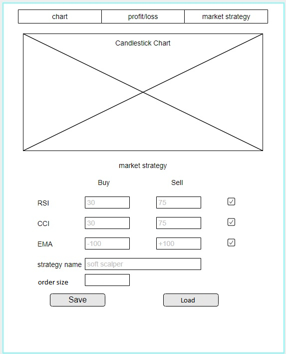

# Anforderungs- und Entwurfsspezifikation ("Pflichtenheft")
Cryptocurrency Algotrader
Autoren: Sasha Koß, Kristoffer Roßbach

<!-- MarkdownTOC autolink=true -->

- [1 Einführung](#1-einf%C3%BChrung)
  - [1.1 Beschreibung](#11-beschreibung)
    - [Projektname: Cryptocurrency Algotrade](#projektname-cryptocurrency-algotrade)
    - [Projektbeschreibung:](#projektbeschreibung)
  - [1.2 Ziele](#12-ziele)
    - [Anwendungsbereich](#anwendungsbereich)
    - [Motivation](#motivation)
    - [Umfang](#umfang)
    - [Marktanforderungen](#marktanforderungen)
    - [Zielgruppe](#zielgruppe)
    - [Abgrenzung](#abgrenzung)
- [2 Anforderungen](#2-anforderungen)
  - [2.1 Funktionale Anforderungen](#21-funktionale-anforderungen)
  - [2.2 Nicht-funktionale Anforderungen](#22-nicht-funktionale-anforderungen)
    - [2.2.1 Rahmenbedingungen](#221-rahmenbedingungen)
    - [2.2.2 Betriebsbedingungen](#222-betriebsbedingungen)
    - [2.2.3 Qualitätsmerkmale](#223-qualit%C3%A4tsmerkmale)
  - [2.3 Graphische Benutzerschnittstelle](#23-graphische-benutzerschnittstelle)
    - [GUI-Mockups](#gui-mockups)
    - [Navigations-Zustandsdiagramm](#navigations-zustandsdiagramm)
  - [2.4 Anforderungen im Detail](#24-anforderungen-im-detail)
    - [Schablone für User Stories](#schablone-f%C3%BCr-user-stories)
    - [Beispiel 1](#beispiel-1)
    - [Beispiel 2](#beispiel-2)
- [3 Technische Beschreibung](#3-technische-beschreibung)
  - [3.1 Systemübersicht](#31-system%C3%BCbersicht)
  - [3.2 Softwarearchitektur](#32-softwarearchitektur)
  - [3.3 Datenmodell](#33-datenmodell)
  - [3.4 Abläufe](#34-abl%C3%A4ufe)
  - [3.5 Entwurf](#35-entwurf)
- [4 Projektorganisation](#4-projektorganisation)
  - [4.1 Annahmen](#41-annahmen)
  - [4.2 Verantwortlichkeiten](#42-verantwortlichkeiten)
  - [4.3 Grober Projektplan](#43-grober-projektplan)
- [5 Anhänge](#5-anh%C3%A4nge)
  - [5.1 Glossar](#51-glossar)
  - [5.2 Referenzen](#52-referenzen)
  - [5.3 Index](#53-index)

<!-- /MarkdownTOC -->

# 1 Einführung

## 1.1 Beschreibung
### Projektname: Cryptocurrency Algotrade
### Projektbeschreibung:
Die Algotrade Software holt sich die aktuelle Handelshistorie einer Crypto-Börse und erstellt anhand dieser Daten eine Candlestick-Chart.
Zeitgleich werden mit den berechneten Candlesticks verschiedene technische Indikatoren ermittelt.

Die Indikatoren werden zur Umsetzung der vom Benutzer konfigurierten Marktstrategie verwendet. Der Benutzer kann die Grenzen für jeden Indikator individuell einstellen und eine Marktentscheidung(Buy/Hold/Sell) damit verknüpfen. Die Positionsgröße wird anhand der Depoteinlage ermittelt, der Benutzer kann dazu einen prozentualen Bereich konfigurieren.

Der Benutzer muss ein Konto mit Einlage auf der jeweiligen Börse besitzen, weil die Algotrade Software die Entscheidungen per API-Request durchführt.

Es kann zusätzlich eine Gewinn/Verlust Übersicht über einen bestimmten Zeitraum eingesehen werden.
## 1.2 Ziele
### Anwendungsbereich
Der Algotrader wird zuert im privaten Bereich zum Testen von Marktstrategien eingesetzt werden.
### Motivation
Die Blockchain bzw. der Cryptocurrencymarkt befindet sich seit 2015 in einer starken und volatilen Wachstumsphase, deswegen kann ein Einstieg in diesen Markt für risikofreudige Unternehmer lukrativ sein.
### Umfang
Die Software wird im ersten Entwicklungsschritt nur mit der Binance API funktionieren, weil diese kostenlos verwendbar ist und eine vergleichbar gute Performance liefert.

Indikatoren:
+ ema auf beliebigen Timeframe
+ MFI
+ RSI
+ CCI

Chart Indikatoren:
+ Ichimoku
+ EMA
+ MFI
+ RSI
+ CCI

### Marktanforderungen
Der Cryptocurrency-Algobot-Markt ist noch Jung, dementsprechend einfach und Teuer sind die aktuellen Produkte am Markt.

Übersicht: https://themerkle.com/top-6-bitcoin-trading-bots/
### Zielgruppe
Die Software ist für Anwender konzipiert die ein Grundverständnis von Markttechnik besitzen und eine indivudelle Marktstrategie an einer Cryptobörse umsetzen wollen.
### Abgrenzung
+ beinhaltet keine vorgefertigten Marktstrategien
+ kein BackTesting der Strategien
+ keine direkten Trades über die GUI

# 2 Anforderungen

## 2.1 Funktionale Anforderungen
    - Use-Case Diagramme
    - Strukturierung der Diagramme in funktionale Gruppen

## 2.2 Nicht-funktionale Anforderungen

### 2.2.1 Rahmenbedingungen
    - Normen, Standards, Protokolle, Hardware, externe Vorgaben

### 2.2.2 Betriebsbedingungen
    - Vorgaben des Kunden (z.B. Web Browser / Betriebssystem Versionen, Programmiersprache)

### 2.2.3 Qualitätsmerkmale
    - Externe Qualitätsanforderungen (z.B. Performance, Sicherheit, Zuverlässigkeit, Benutzerfreundlichkeit)

## 2.3 Graphische Benutzerschnittstelle
### GUI-Mockups

### Navigations-Zustandsdiagramm
    - Modellierung der Navigation zwischen den Screens der GUI-Mockups als Zustandsdiagramm

## 2.4 Anforderungen im Detail
    - User Stories mit Akzeptanzkritierien
    - Optional: Name (oder ID) und Priorität ("Must", "Should", "Could", "Won't")
    - Strukturierung der User Stories in funktionale Gruppen

### Schablone für User Stories

| **Als** | **möchte ich** | **so dass** | **Akzeptanz** |
| :------ | :----- | :------ | :-------- |
| Wer | Was | Warum | Wann akzeptiert |

### Beispiel 1

| **Als** | **möchte ich** | **so dass** | **Akzeptanz** |
| :------ | :----- | :------ | :-------- |
| Benutzer | bei Fehleingabe die Lösung angezeigt bekommen | ich lernen kann | Lösung wird angezeigt |

### Beispiel 2

| **Name**| **In meiner Rolle als**...|   ...**möchte ich**...   | ..., **so dass**... | **Erfüllt, wenn**... | **Priorität**   |
|:-----|:----------:|:-------------------|:-------------|:---------|:----------------|
| Lernen  |Benutzer| bei Fehleingabe die Lösung angezeigt bekommen|ich lernen kann| Lösung wird angezeigt | Muss |

# 3 Technische Beschreibung

## 3.1 Systemübersicht
    - Systemarchitekturdiagramm ("Box-And-Arrow" Diagramm)
    - Schnittstellenbeschreibung
    - Kommunikationsprotokolle, Datenformate

## 3.2 Softwarearchitektur
    - Darstellung von Softwarebausteinen (Module, Schichten, Komponenten)

## 3.3 Datenmodell
    - Konzeptionelles Analyseklassendiagramm

## 3.4 Abläufe
    - Aktivitätsdiagramme für relevante Use Cases
    - Aktivitätsdiagramm für den Ablauf sämtlicher Use Cases

## 3.5 Entwurf
    - Detaillierte UML-Diagramme für relevante Softwarebausteine

# 4 Projektorganisation

## 4.1 Annahmen
    - Nicht durch den Kunden definierte spezifische Annahmen, Anforderungen und Abhängigkeiten
    - Verwendete Technologien (Programmiersprache, Frameworks, etc.)
    - Einschränkungen, Betriebsbedingungen und Faktoren, die die Entwicklung beeinflussen (Betriebssysteme, Entwicklungsumgebung)
    - Interne Qualitätsanforderungen (z.B. Softwarequalitätsmerkmale wie z.B. Erweiterbarkeit)

## 4.2 Verantwortlichkeiten
    - Zuordnung von Personen zu Softwarebausteinen aus Kapitel 3.1 und 3.2
    - Rollendefinition und Zuordnung

## 4.3 Grober Projektplan
    - Meilensteine

# 5 Anhänge

## 5.1 Glossar
    - Definitionen, Abkürzungen, Begriffe

## 5.2 Referenzen
    - Handbücher, Gesetze

## 5.3 Index

